# MVP за 48 часов + задачи по ролям

## Принцип scope

**Обязательный MVP** — то, без чего нельзя показать жюри сквозной сценарий:

> «На карте Каспия видны эко-тендеры → клик → Risk Score → понятное объяснение → видно, откуда взялись данные».

Архитектура при этом уже разбита на сервисы и адаптеры — не монолит-демо.

---

## Must / Should / Later

### Must (обязательно)

| # | Функция | Доказательство на демо |
|---|---------|------------------------|
| M1 | Каталог тендеров (fixtures + ≥1 live source) | Список + фильтр eco |
| M2 | Risk Score 0–100 (CatBoost или обученный на silver labels) | Число + band на карточке |
| M3 | Объяснение (LLM или template fallback) | 3–5 причин текстом |
| M4 | Интерактивная карта Leaflet | Маркеры по риску + bbox |
| M5 | Рыночное сравнение (seed prices) | overprice в reasons |
| M6 | Docker Compose up одной командой | Запуск у жюри |
| M7 | REST API + Swagger | Прозрачность |
| M8 | Disclaimer / аудит-флаг в UI | Зрелость продукта |

### Should (если успеваем)

| # | Функция |
|---|---------|
| S1 | Полигоны работ + пересечение с ООПТ |
| S2 | NASA GIBS overlay |
| S3 | История подрядчика на карточке |
| S4 | Batch rescore + Flower мониторинг |
| S5 | Простой login (analyst/admin) |
| S6 | RU или второй country adapter (тонкий) |

### Later (после хакатона)

| # | Функция |
|---|---------|
| L1 | Kafka, отдельные БД на сервис |
| L2 | Oil spill detection по Sentinel |
| L3 | Graph связей подрядчиков |
| L4 | SSO / Гос. ID |
| L5 | Собственная нейросеть |
| L6 | Публичный open data portal + API keys |
| L7 | Мобильное приложение |

---

## Roadmap 48 часов

```mermaid
gantt
  title EcoTender AI — 48h
  dateFormat HH
  axisFormat %H:00

  section Foundation
  Repo+Compose+PG/PostGIS     :f1, 00, 4h
  Shared schemas+Alembic      :f2, 02, 4h
  Gateway health+CORS         :f3, 04, 3h

  section Data
  Fixtures 80 tenders         :d1, 03, 5h
  Market seed CSV             :d2, 04, 3h
  Geo coastline+regions       :d3, 06, 4h
  Live parser v1              :d4, 08, 8h

  section ML
  Feature builder             :m1, 06, 5h
  Weak labels+train CatBoost  :m2, 09, 6h
  Risk API+anomalies          :m3, 12, 5h
  LLM explain+fallback        :m4, 14, 5h

  section Frontend
  Map+markers                 :u1, 08, 6h
  Tender list+filters         :u2, 10, 5h
  Risk card UI                :u3, 14, 5h
  Polish+disclaimer           :u4, 36, 4h

  section Integration
  E2E wiring+demo script      :i1, 32, 8h
  Buffer/fixes                :i2, 40, 8h
```

### День 1 (0–24ч)

| Часы | Backend | Frontend | ML | Parsers |
|------|---------|----------|-----|---------|
| 0–4 | Compose, PG, schemas | Vite+MUI skeleton | Feature list freeze | Fixture schema |
| 4–8 | tender CRUD API | Router, layout | Feature builder | Load fixtures |
| 8–12 | market estimate | Map base OSM | Weak labels | Coastline import |
| 12–16 | geo GeoJSON API | Markers by risk | Train CatBoost | Playwright list page |
| 16–20 | risk score endpoint | Tender drawer | Anomaly rules | Detail normalize |
| 20–24 | Celery hook events | Risk panel stub | Save model artifact | Job status API |

### День 2 (24–48ч)

| Часы | Фокус |
|------|-------|
| 24–30 | LLM explain + template fallback; UI explanation |
| 30–36 | Live parser polish; GIBS optional; contractor stats |
| 36–42 | E2E demo path; seed demo tenders с «вау»-кейсами |
| 42–46 | Багфикс, performance bbox, README для жюри |
| 46–48 | Репетиция питча, backup offline demo (fixtures only) |

---

## Задачи Backend

- [ ] `docker-compose.yml`: postgres(postgis), redis, minio, gateway, services, worker, beat
- [ ] LLM via external API (`LLM_API_KEY` / `LLM_BASE_URL`) + template fallback
- [ ] SQL init: extensions + schemas
- [ ] Shared pydantic: `NormalizedTender`, events, enums
- [ ] tender-service: models, alembic, CRUD, filters, upsert by (source, external_id)
- [ ] market-service: seed load, estimate endpoint
- [ ] geo-service: import geojson, `/map/features`, GIST queries
- [ ] risk-engine: load model, score, anomalies, explain, model_registry
- [ ] api-gateway: proxy, JWT stub, request-id, rate-limit
- [ ] audit_log middleware
- [ ] health/ready probes
- [ ] OpenAPI tags + примеры
- [ ] Idempotent upsert + outbox table (минимум)

---

## Задачи Frontend

- [ ] Vite+React+TS+MUI тема (не purple-saas клише; каспийский teal/sand — сдержанно)
- [ ] Layout: Map primary + side panel
- [ ] Leaflet map: coastline, tender markers, color by risk_band
- [ ] Filters: country, category, risk, search
- [ ] Tender list virtualized / pagination
- [ ] Risk card: score gauge, reasons, anomalies, model version
- [ ] Disclaimer banner
- [ ] Empty/loading/error states
- [ ] i18n keys ru (минимум)
- [ ] Demo mode toggle (fixtures highlight)
- [ ] «О данных» attribution page

---

## Задачи ML

- [ ] Зафиксировать feature dictionary v1
- [ ] `build_features.py` из БД/fixtures
- [ ] `weak_labels.py`
- [ ] Train notebook/script + metrics report
- [ ] Export `model.cbm` + `model_meta.json`
- [ ] Inference service wrapper
- [ ] Anomaly rules module
- [ ] Explainer: OpenAI-compatible API client + template fallback
- [ ] Prompt versioning + `explanation_meta` in API response
- [ ] Slice metrics по eco_category

---

## Задачи парсеров

- [ ] `SourceAdapter` interface в shared
- [ ] `FixtureAdapter` (JSON/NDJSON)
- [ ] `KazakhstanGoszakupAdapter` (или RU EIS subset) — list + detail
- [ ] Celery tasks: discover / fetch / normalize / publish
- [ ] raw_documents → MinIO
- [ ] crawl_job metrics
- [ ] Robots/rate-limit polite delay
- [ ] Regression HTML fixtures в tests/
- [ ] Eco keyword filter
- [ ] Dedup by checksum

---

## Критерии приёмки демо

1. `docker compose up` → UI открывается  
2. На карте ≥ 50 точек Каспия  
3. Есть ≥ 3 тендера с risk ≥ 70 и читаемым объяснением  
4. Показан overprice относительно рынка  
5. Swagger доступен  
6. Есть история: «данные из источника X, модель Y»  
7. Offline fallback: демо без LLM API-ключа и без внешнего портала закупок  

---

## Рекомендации команде (4–6 человек)

| Роль | Фокус |
|------|-------|
| Architect/Backend lead | Compose, gateway, tender, contracts |
| Data/Parser | fixtures, live adapter, raw store |
| ML | features, catboost, explain |
| Frontend | map + risk UX |
| Floater | geo layers, demo script, pitch deck |
