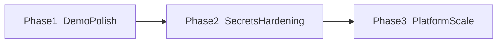

# EcoTender AI — roadmap фазы 1→3

Хакатонный каркас закрывает Must MVP: карта KZ, CatBoost Risk Score, LLM/template explain, goszakup, PostGIS, кабинет ключей, smoke.  
Дальше — путь к production-shaped платформе (см. также [SCALING.md](SCALING.md), [MVP_48H.md](MVP_48H.md)).

---

## Phase 1 — Demo polish

**Цель:** уверенный 2-минутный питч без белых экранов и с читаемым кабинетом.

| Deliverable | Status | Где |
|-------------|--------|-----|
| UI кабинета: название · токен · статус | Done | `apps/web/src/AdminPanel.tsx` |
| Кабинет администратора (не «Админка») | Done | App + AdminPanel |
| Smoke: health, ready, login, me, risk | Done | `scripts/smoke_check.py` |
| Docs: README + DEMO_SCRIPT | Done | `README.md`, `docs/DEMO_SCRIPT.md` |

**Критерий:** `python scripts/smoke_check.py` → `SMOKE OK`; демо по `KZ-ECO-1001` / `1004` / `1002`.

---

## Phase 2 — Secrets hardening (без полного SSO)

**Цель:** ключи не лежат plaintext в Redis/file; IAM остаётся demo JWT.

| Deliverable | Status | Детали |
|-------------|--------|--------|
| Fernet at rest (`enc:v1:`) | Done | `packages/shared/ecotender_shared/runtime_secrets.py` |
| `SECRET_ENCRYPTION_KEY` (+ fallback `JWT_SECRET`) | Done | `.env.example`, `docker-compose.yml` |
| Автомиграция plaintext → encrypted на bootstrap | Done | `bootstrap_from_file()` |
| UI/API маскируют секреты | Done | admin integrations |

**Критерий:** в `data/runtime/config.json` и Redis нет plaintext `sk-…`; set key через кабинет OK.

**Вне Phase 2:** Keycloak/SSO, Vault, KMS, ротация ключей, audit в БД.

---

## Phase 3 — Platform scale (next)

**Цель:** гос. контур. Делать подфазами; каждая даёт отдельный инкремент.

### 3A — IAM / SSO

- Keycloak в compose или внешний IdP (eGov/ЕСИА — позже).
- Gateway: OIDC JWT вместо HS256 demo users.
- Роли `viewer` | `analyst` | `auditor` | `admin` → realm roles.
- Write/кабинет только для `admin`.
- Master encryption key — в Vault/K8s Secret.

**Критерий:** login через IdP; demo passwords убраны из gateway.

### 3B — Event bus (Kafka)

- Kafka (KRaft) в infra.
- Топики: `tender.ingested`, `tender.scored`, `contractor.updated`.
- Ingestion публикует; risk/tender — consumers.
- Celery остаётся для crawl; Kafka — domain events.

**Критерий:** crawl → событие → rescore без прямого HTTP-call.

### 3C — Второй country-адаптер

- Тонкий adapter (RU / AZ) по `SourceAdapter`.
- Новый parser в кабинете: `source_code`, token, country.
- UI `country=` + fixtures + map bbox.

**Критерий:** тендеры с `country_code` ≠ KZ в API и на карте.

### 3D — Graph подрядчиков

- Win-edges / co-bid; таблица `contractor_edges` (Postgres CTE; Neo4j — по объёму).
- UI: связанные узлы на карточке подрядчика (2–3 hops).

**Критерий:** у high-risk winner видны связанные юрлица с агрегатом risk.

### 3E — Sentinel / oil spill

- Metadata / готовые spill layers в geo-service.
- Слой `oil_spill` + пересечение с work polygons / tenders.
- Toggle в UI рядом с GIBS/ООПТ; reason-код при пересечении.

**Критерий:** spill на карте + tender в зоне помечен.

---

## Порядок Phase 3

1. **3A IAM** — доверие к кабинету ключей  
2. **3C второй country** — быстрый продуктовый инкремент  
3. **3B Kafka** — когда ≥2 consumers и нужен event audit  
4. **3D graph** — после стабильных contractor entities  
5. **3E Sentinel** — geo-пилот / расширенное жюри  

---

## Сводка

| Phase | Фокус | Состояние |
|-------|--------|-----------|
| 1 | Demo polish + smoke | **Done** |
| 2 | Encrypted runtime secrets | **Done** |
| 3 | IAM → country → Kafka → graph → Sentinel | **Planned** |

**Следующий спринт:** выбрать один инкремент — **3A (Keycloak)** или **3C (второй country adapter)**.
