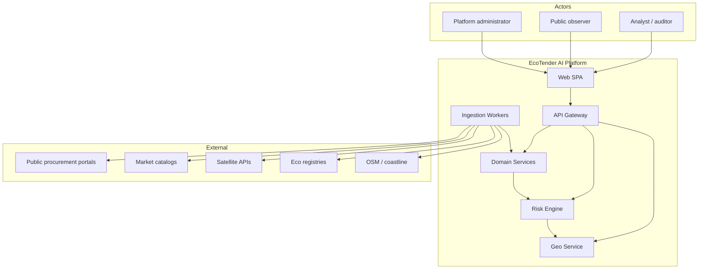
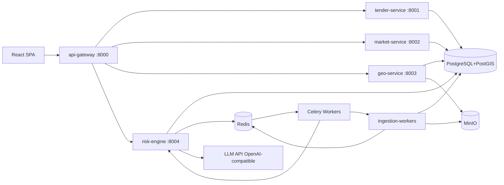
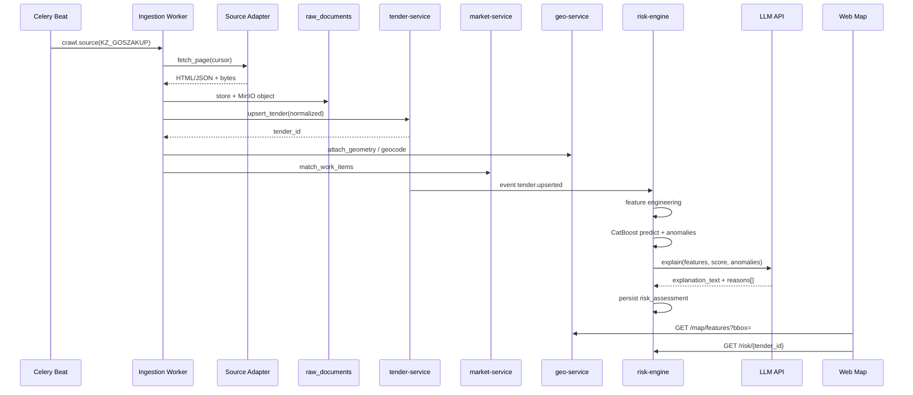

**Language:** [Русский](../ru/ARCHITECTURE.md) · [English](ARCHITECTURE.md) · [Қазақша](../kk/ARCHITECTURE.md)

# EcoTender AI — Platform Architecture

## 1. Design Principle: “Production-shaped MVP”

We do **not** build a demo on a single FastAPI + SQLite.  
We build a **thin slice of production architecture**:

| Principle | MVP implementation (48h) | Scale after the hackathon |
|-----------|--------------------------|---------------------------|
| Bounded contexts | Separate services with clear APIs | Independent deploy/scaling |
| Source adapters | `SourceAdapter` interface + 1–2 countries | Plugins KZ/AZ/RU/TM/IR |
| Events | Redis Streams (outbox) | Kafka / NATS JetStream |
| Idempotency | `external_id` + upsert | Exactly-once ingestion |
| Audit | `audit_log` table + middleware | SIEM / WORM storage |
| Auth | JWT + roles (viewer/analyst/admin) | SSO (Keycloak / ESIA / eGov) |
| Observability | structured JSON logs + health | OpenTelemetry + Prometheus |
| Feature flags | env + DB flags | LaunchDarkly / Unleash |
| GIS | PostGIS + tile layers | Vector tiles (Martin/pg_tileserv) |
| AI | CatBoost + LLM API (OpenAI-compatible) | Private LLM / VPC endpoint |

**Rule:** any hackathon shortcut must be a **replaceable adapter**, not hard-wired into domain logic.

---

## 2. Context Map (C4 Level 1)



---

## 3. Microservices (C4 Level 2)



> **AI split:** CatBoost artifact lives in `risk-engine` (own decision).  
> Explanation goes through external `LLM_BASE_URL` + `LLM_API_KEY`.  
> Without a key → deterministic `template_fallback` (demo-safe offline).
### 3.1 Service Responsibilities

| Service | Bounded Context | Owns data | Does not do |
|---------|-----------------|-----------|-------------|
| **api-gateway** | Edge | sessions, rate-limit, request-id | business logic |
| **tender-service** | Procurement | tenders, lots, bidders, contracts, amendments | ML, GIS calculation |
| **market-service** | Pricing | price_catalog, price_observations, indices | tender parsing |
| **geo-service** | Spatial | geometries, eco_layers, satellite_refs | risk score |
| **risk-engine** | Risk & Explain | risk_assessments, anomalies, explanations, model_versions | UI |
| **ingestion-workers** | Collect | raw_documents, crawl_jobs, source_cursors | public API |

### 3.2 Sync vs Async

| Interaction | Pattern | Why |
|-------------|---------|-----|
| UI → API | Sync REST/JSON | UX latency |
| Ingestion → Domain | Async (Celery + Redis Streams) | long scrape |
| Tender created/updated → Risk | Event `tender.upserted` | loose coupling |
| Risk scored → Explanation | Pipeline step / queue | LLM slower than CatBoost |
| Geo enrichment | Async job | reverse geocode / area calc |

### 3.3 Event Contract (schema v1)

```json
{
  "event_id": "uuid",
  "event_type": "tender.upserted",
  "occurred_at": "2026-08-05T10:00:00Z",
  "producer": "tender-service",
  "schema_version": 1,
  "payload": {
    "tender_id": "uuid",
    "country_code": "KZ",
    "external_id": "123456",
    "change_hash": "sha256:..."
  }
}
```

All events are versioned (`schema_version`). Breaking changes → new type or v2 topic.

---

## 4. Layers Inside a Service (Hexagonal Architecture)

```
services/<name>/
  app/
    api/              # FastAPI routers (adapters/in)
    domain/           # entities, value objects, policies
    application/      # use-cases / commands / queries
    infrastructure/   # SQLAlchemy, Redis, HTTP clients
    workers/          # Celery tasks (if any)
  alembic/
  tests/
  Dockerfile
  pyproject.toml
```

**Dependency rule:** `api → application → domain ← infrastructure`.  
Domain does not import FastAPI/SQLAlchemy.

---

## 5. Data Flow: From Parser to Map



Fallback: if `LLM_API_KEY` missing or API errors → `template_explain` (same reasons codes).
---

## 6. Multi-country Source Adapter (Critical for Scale)

```python
# packages/shared/ecotender_shared/ingestion/base.py
from abc import ABC, abstractmethod
from typing import AsyncIterator
from pydantic import BaseModel

class RawTenderPage(BaseModel):
    source_code: str
    country_code: str  # ISO 3166-1 alpha-2
    external_id: str
    fetched_at: str
    content_type: str  # application/json | text/html
    payload: bytes
    checksum: str

class NormalizedTender(BaseModel):
    country_code: str
    external_id: str
    title: str
    description: str | None
    customer_name: str | None
    published_at: str | None
    deadline_at: str | None
    amount: float | None
    currency: str | None
    region_code: str | None
    eco_category: str | None
    participants_count: int | None
    # ... extensible extras dict: dict

class SourceAdapter(ABC):
    source_code: str
    country_code: str

    @abstractmethod
    async def discover(self, cursor: str | None) -> AsyncIterator[str]:
        """Yield external_ids or list URLs."""

    @abstractmethod
    async def fetch(self, ref: str) -> RawTenderPage:
        ...

    @abstractmethod
    def normalize(self, raw: RawTenderPage) -> NormalizedTender:
        ...
```

MVP: implement **one** adapter in depth (e.g. KZ goszakup) + a **fixture adapter** (JSON fixtures) for the demo.  
After the hackathon: add AZ/RU without changing tender-service.

---

## 7. Security and Compliance (From Day One)

Even in the MVP we lay down:

1. **RBAC:** `viewer` | `analyst` | `auditor` | `admin`
2. **Audit trail:** who viewed/exported a risk card (important for government audit)
3. **PII minimization:** officials’ full names — optional, masking in public API
4. **Secrets:** only via env / Docker secrets, never in git
5. **CORS / rate limit** on the gateway
6. **Idempotency-Key** for write endpoints
7. **Disclaimer:** Risk Score is an analytical indicator, not a legal accusation

---

## 8. Non-Functional Requirements (Targets)

| Metric | MVP | National platform |
|--------|-----|-------------------|
| Latency list API p95 | < 500 ms | < 200 ms |
| Map bbox query p95 | < 800 ms | < 150 ms (tiles) |
| Risk scoring batch | 100 tenders / min | 10k+ / min |
| Availability | best-effort | 99.9% |
| Data retention raw | 30 days | per regulation (years) |
| Countries | 1 + fixtures | 5 Caspian littoral |

---

## 9. Technology Choices and Libraries

### Backend
- `fastapi`, `uvicorn[standard]`, `pydantic` v2, `sqlalchemy[asyncio]` 2.x
- `geoalchemy2`, `alembic`, `celery[redis]`, `httpx`, `tenacity`
- `structlog` or `python-json-logger`
- `prometheus-fastapi-instrumentator` (optional on Day 2)

### Ingestion
- `playwright`, `beautifulsoup4`, `lxml`, `selectolax` (fast HTML)
- `pdfplumber` / `pymupdf` for PDF specifications
- `hashlib` + content-addressed MinIO keys

### ML / AI
- `catboost`, `pandas`, `numpy`, `scikit-learn`, `optuna` (later)
- `shap` for feature contribution (optional in explain)
- `httpx` → OpenAI-compatible Chat Completions API (`LLM_BASE_URL`)
- Template fallback without a key / on network error
- `joblib` / native CatBoost model save

### GIS
- PostGIS 3.x, `geoalchemy2`, `shapely`, `geopandas` (offline enrichment)
- Frontend: `leaflet`, `react-leaflet`, optional `leaflet.markercluster`

### Frontend
- React 19+, TypeScript, Vite 6, MUI 7, React Query / TanStack Query
- `react-leaflet` 5 (Leaflet 1.9)
- Zustand (light UI state), React Router
- i18n (ru/kz/en) — lay down keys from the start

### Infra
- Docker Compose (dev), later K8s Helm charts
- Nginx reverse proxy
- MinIO (S3-compatible raw storage)
- Mailhog / stub notifications (later)

---

## 10. Anti-Patterns We Avoid

1. ❌ One “god service” with parser + ML + API + UI templates  
2. ❌ Hardcoded parser selectors inside domain entities  
3. ❌ Risk Score without model version and feature snapshot  
4. ❌ LLM as the sole source of the risk decision  
5. ❌ Geometry in JSONB without PostGIS indexes  
6. ❌ Missing uniqueness of `external_id` + `source_code`  

---

## 11. Directory Layout (Full)

```text
EcoTender AI/
├── README.md
├── .env.example
├── docker-compose.yml
├── docker-compose.override.yml
├── Makefile
├── apps/
│   └── web/
│       ├── package.json
│       ├── vite.config.ts
│       ├── index.html
│       └── src/
│           ├── app/
│           ├── features/
│           │   ├── map/
│           │   ├── tenders/
│           │   ├── risk/
│           │   └── auth/
│           ├── shared/
│           └── main.tsx
├── services/
│   ├── api-gateway/
│   ├── tender-service/
│   ├── market-service/
│   ├── geo-service/
│   ├── risk-engine/
│   └── ingestion-workers/
├── packages/
│   └── shared/
│       └── ecotender_shared/
│           ├── schemas/
│           ├── events/
│           ├── enums/
│           └── ingestion/
├── ml/
│   ├── notebooks/
│   ├── training/
│   ├── features/
│   ├── models/           # .cbm artifacts (git-lfs / MinIO)
│   └── evaluation/
├── infra/
│   ├── postgres/init/
│   │   └── 01_extensions.sql
│   ├── nginx/
│   └── otel/
└── docs/
```

See also: [ER_DIAGRAM.md](ER_DIAGRAM.md), [ML_RISK_ENGINE.md](ML_RISK_ENGINE.md), [API.md](API.md), [SCALING.md](SCALING.md).
