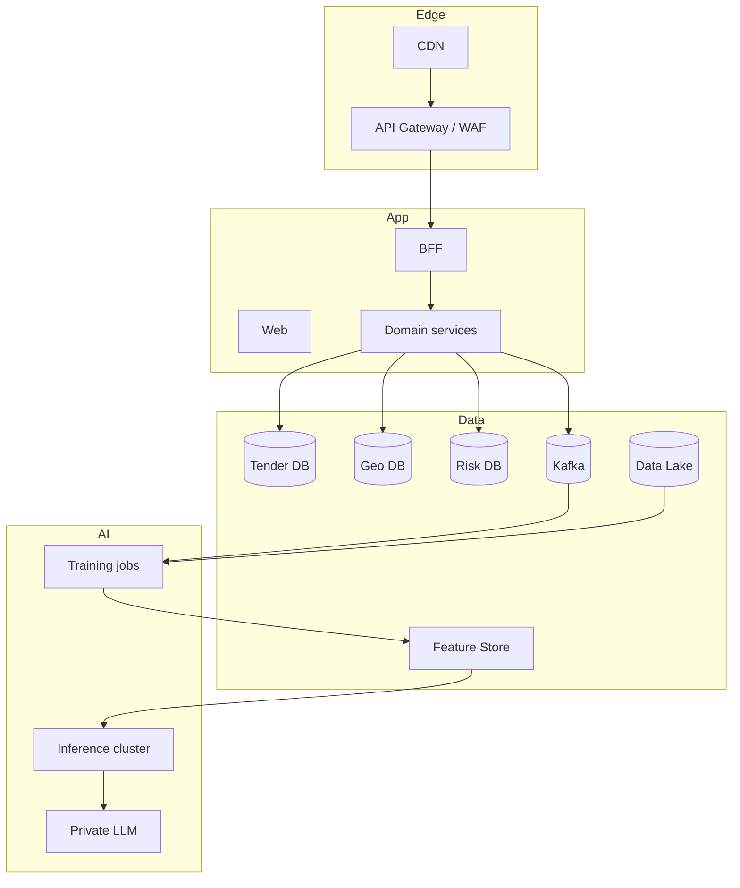

**Language:** [Русский](../ru/SCALING.md) · [English](SCALING.md) · [Қазақша](../kk/SCALING.md)

# Scaling to a National Platform

The MVP architecture is designed so the domain does **not need to be rewritten** as load grows.

## Phases

### Phase 0 — Hackathon (now)
- Compose, single PG, Redis Streams/Celery
- 1–2 source adapters + fixtures
- CatBoost + LLM API (OpenAI-compatible) + template fallback
- JWT basic RBAC

### Phase 1 — Pilot (1 country, 1 agency)
- Helm/K8s, HPA on workers
- Official API keys, parsing SLA
- Auditor workspace + gold labels
- Backup/PITR, secrets manager
- Public disclaimer + methodology whitepaper

### Phase 2 — Multi-country Caspian
- Adapter marketplace (KZ/AZ/RU/TM/IR)
- Per-country compliance profiles
- i18n + multi-currency FX service
- Federated auth (national ID where required)

### Phase 3 — National platform
- Kafka + CDC (Debezium)
- DB per bounded context
- Feature store (Feast) + model registry (MLflow)
- Vector tiles, data lake (S3) for satellite
- SIEM integration, WORM audit
- Open data portal + partner API

---

## What Is Already Built In and Won’t Break

| MVP decision | Why it matters at scale |
|--------------|-------------------------|
| SourceAdapter interface | New countries = new package |
| (source_code, external_id) | Global idempotency |
| model_version on assessment | ML changes without losing history |
| schema-per-service | DB split |
| Events schema_version | Async evolution |
| Explain prompt_version | Court/audit reproducibility |
| GeoJSON map API | Swap to tiles without changing UI contract |
| Risk band thresholds in config | Agency policy |

---

## Target Topology (Phase 3)

---

## Operational Practices

1. **SLOs:** availability, scrape success, scoring lag  
2. **Chaos:** kill workers, verify outbox  
3. **Data quality contracts:** Great Expectations / pandera on fixtures  
4. **Security:** pen-test, dependency scanning, SBOM  
5. **Governance:** methodology board for Risk Score thresholds  

---

## Monetization / Adoption (optional)

- B2G: license for Supreme Audit / anti-corruption bodies / ministry of ecology  
- B2B: due diligence for banks/insurers of eco-projects  
- Open core: public map + paid auditor cockpit  
