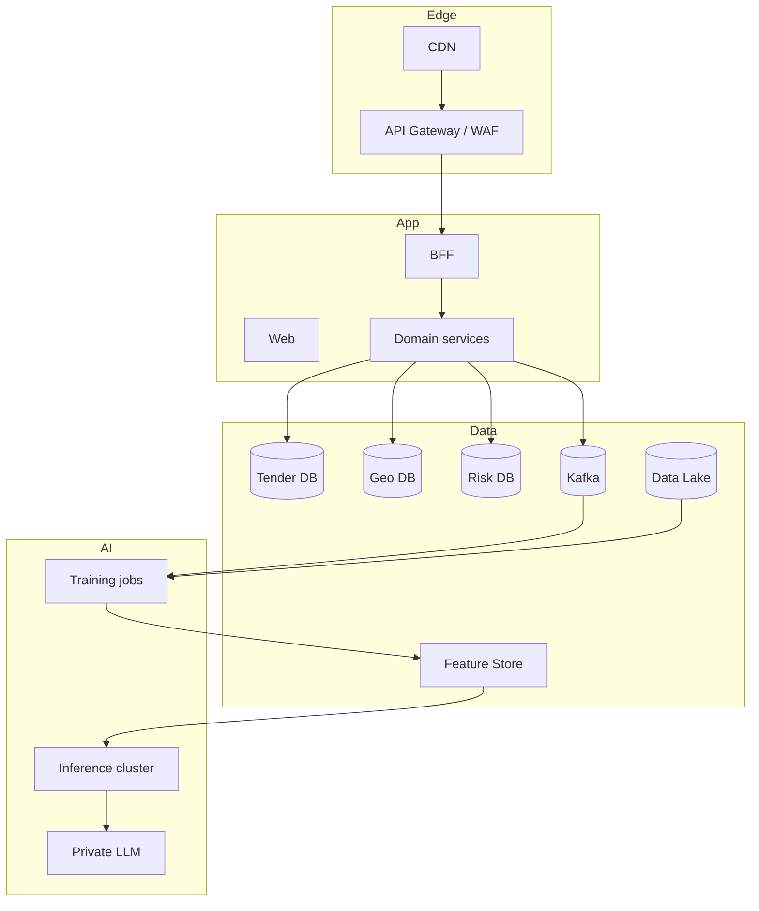

**Тіл / Language:** [Русский](../ru/SCALING.md) · [English](../en/SCALING.md) · [Қазақша](SCALING.md)

# Мемлекеттік платформаға дейін масштабтау

MVP архитектурасы өсу кезінде доменді **қайта жазбау** үшін жобаланған.

## Фазалар

### Phase 0 — Hackathon (қазір)
- Compose, бір PG, Redis Streams/Celery
- 1–2 source adapters + fixtures
- CatBoost + LLM API (OpenAI-compatible) + template fallback
- JWT basic RBAC

### Phase 1 — Pilot (1 ел, 1 ведомство)
- Helm/K8s, workers-ке HPA
- Official API keys, парсинг SLA
- Auditor workspace + gold labels
- Backup/PITR, secrets manager
- Public disclaimer + methodology whitepaper

### Phase 2 — Multi-country Caspian
- Adapter marketplace (KZ/AZ/RU/TM/IR)
- Per-country compliance profiles
- i18n + multi-currency FX service
- Federated auth (қажет жерде national ID)

### Phase 3 — National platform
- Kafka + CDC (Debezium)
- DB per bounded context
- Feature store (Feast) + model registry (MLflow)
- Vector tiles, data lake (S3) for satellite
- SIEM integration, WORM audit
- Open data portal + partner API

---

## Не қаланған және бұзылмайды

| MVP шешімі | Масштабта не үшін |
|-------------|-------------------|
| SourceAdapter interface | Жаңа елдер = жаңа пакет |
| (source_code, external_id) | Жаһандық идемпотенттілік |
| assessment-те model_version | Тарихты жоғалтпай ML ауыстыру |
| schema-per-service | Split DB |
| Events schema_version | Async эволюция |
| Explain prompt_version | Сот/аудит қайталануы |
| GeoJSON map API | UI контрактын өзгертпей tiles-ке ауысу |
| Risk band thresholds in config | Ведомство саясаты |

---

## Мақсатты схема (Phase 3)

---

## Операциялық тәжірибелер

1. **SLOs:** availability, scrape success, scoring lag  
2. **Chaos:** worker-ларды өлтіру, outbox тексеру  
3. **Data quality contracts:** fixtures-те Great Expectations / pandera  
4. **Security:** pen-test, dependency scanning, SBOM  
5. **Governance:** Risk Score шектері үшін methodology board  

---

## Монетизация / енгізу (опционалды)

- B2G: Есеп комитеті / антикорр. органдар / экология министрлігі үшін лицензия  
- B2B: эко-жобалардың банктері/сақтандырушылары үшін due diligence  
- Open core: ашық карта + ақылы auditor cockpit  
