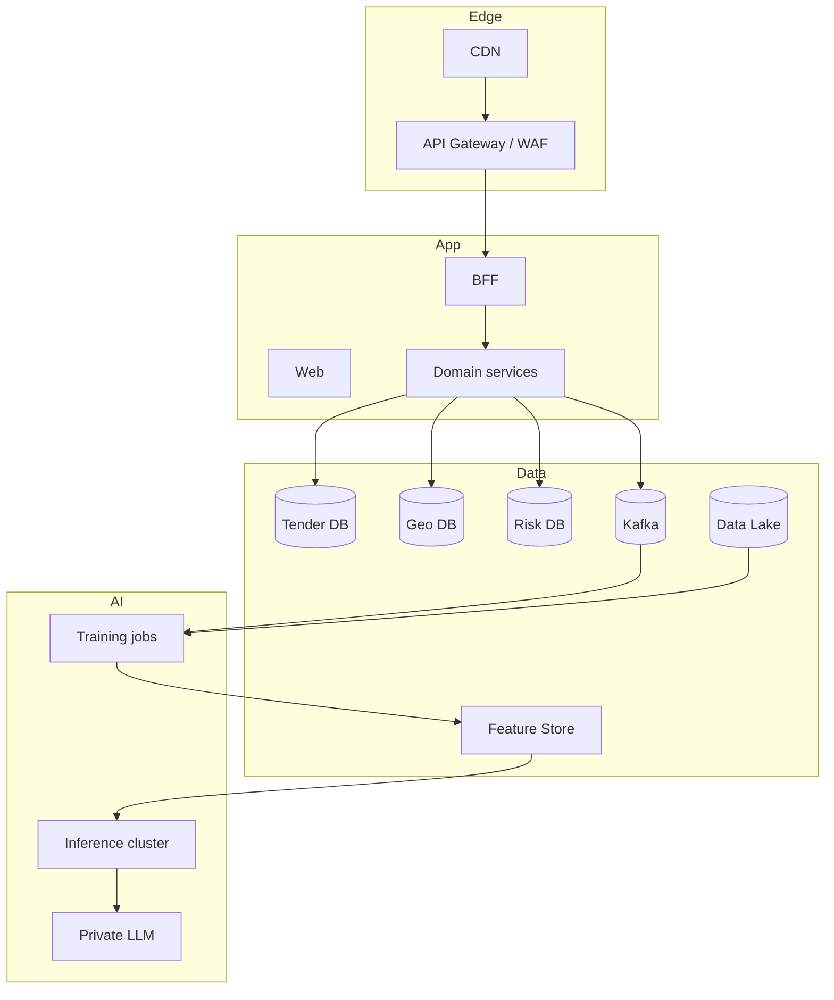

**Язык / Language / Тіл:** [Русский](SCALING.md) · [English](../en/SCALING.md) · [Қазақша](../kk/SCALING.md)

# Масштабирование до государственной платформы

Архитектура MVP спроектирована так, чтобы **не переписывать** домен при росте.

## Фазы

### Phase 0 — Hackathon (сейчас)
- Compose, одна PG, Redis Streams/Celery
- 1–2 source adapters + fixtures
- CatBoost + LLM API (OpenAI-compatible) + template fallback
- JWT basic RBAC

### Phase 1 — Pilot (1 страна, 1 ведомство)
- Helm/K8s, HPA на workers
- Official API keys, SLA парсинга
- Auditor workspace + gold labels
- Backup/PITR, secrets manager
- Public disclaimer + methodology whitepaper

### Phase 2 — Multi-country Caspian
- Adapter marketplace (KZ/AZ/RU/TM/IR)
- Per-country compliance profiles
- i18n + multi-currency FX service
- Federated auth (national ID where required)

### Phase 3 — National platform
- Kafka + CDC (Debezium)
- DB per bounded context
- Feature store (Feast) + model registry (MLflow)
- Vector tiles, data lake (S3) for satellite
- SIEM integration, WORM audit
- Open data portal + partner API

---

## Что уже заложено и не ломается

| Решение MVP | Зачем на масштабе |
|-------------|-------------------|
| SourceAdapter interface | Новые страны = новый пакет |
| (source_code, external_id) | Глобальная идемпотентность |
| model_version на assessment | Смена ML без потери истории |
| schema-per-service | Split DB |
| Events schema_version | Async evolution |
| Explain prompt_version | Воспроизводимость суда/аудита |
| GeoJSON map API | Замена на tiles без смены UI контракта |
| Risk band thresholds in config | Политика ведомства |

---

## Целевая схема (Phase 3)

---

## Операционные практики

1. **SLOs:** availability, scrape success, scoring lag  
2. **Chaos:** убийство worker'ов, проверка outbox  
3. **Data quality contracts:** Great Expectations / pandera на fixtures  
4. **Security:** pen-test, dependency scanning, SBOM  
5. **Governance:** methodology board для порогов Risk Score  

---

## Монетизация / внедрение (опционально)

- B2G: лицензия для Счётной палаты / антикорр. органов / минэкологии  
- B2B: due diligence для банков/страховщиков эко-проектов  
- Open core: публичная карта + платный auditor cockpit  
